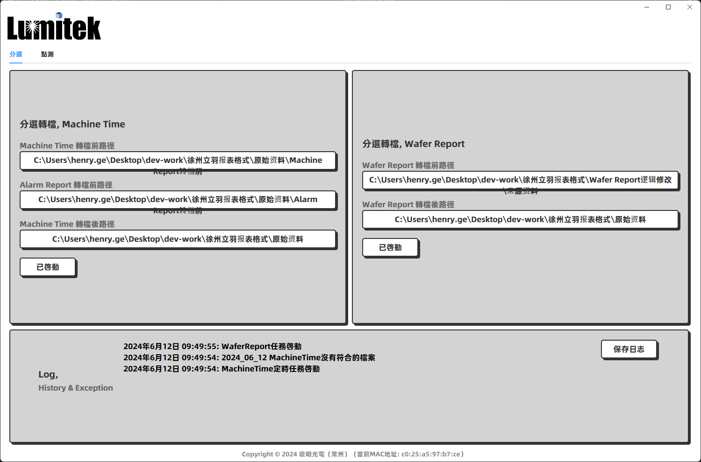
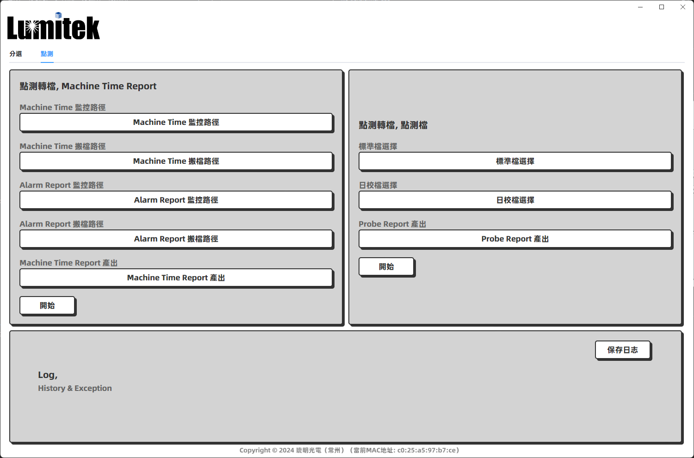
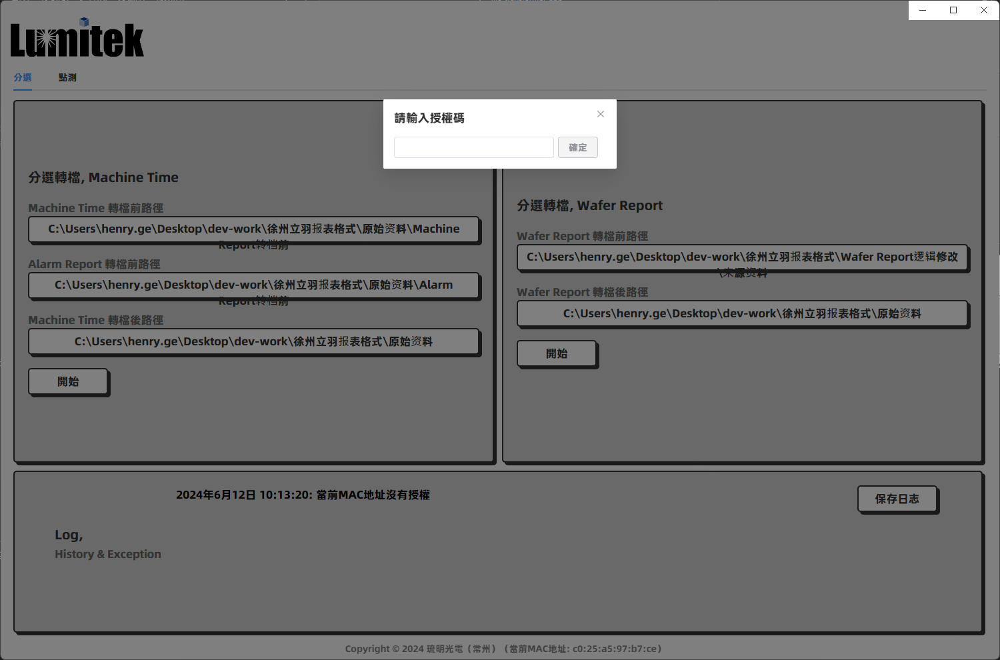

# File Transformer 转档应用
一个自动将机台档案转为Excel文件的跨平台应用 ✨

## 功能
- 根据不同机型的产品档案（分选机型和点测机型）来执行相应转换为Excel的逻辑
- 每日定时处理档案
- 实时监控路径如果有档案产生便会执行转档操作
- 支持保存生成的日志
- 手动选择路径之后会保存选择的路径

## 界面

## 注意
软件是绑定MAC地址的，第一次使用需要授权，授权码使用MD5加盐加密生成

## 技术栈
- 使用Vite构建

主要技术：
- Electron
- TypeScript
- Vue3
- Element plus
- Pinia
- Prettier

依赖库：
- electron-forge
- node-xlsx
- node-schedule
- iconv-lite
- md5
- decimal.js
- sweetalert2
